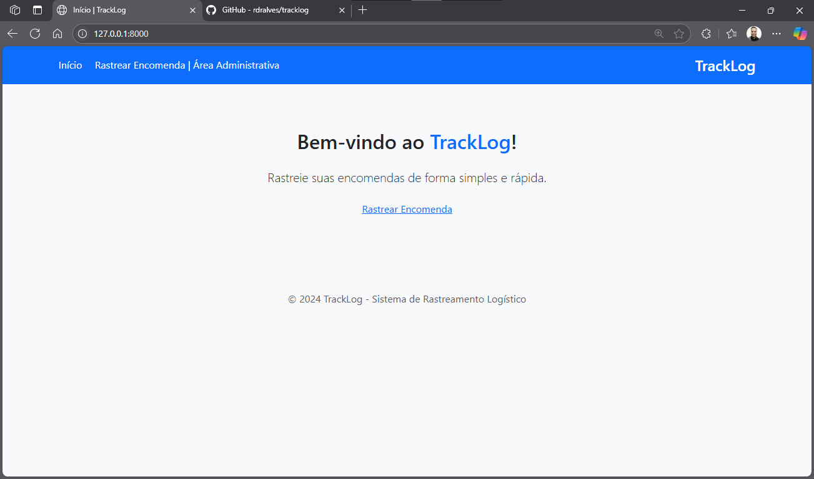

# TrackLog

Sistema de rastreamento e gestão de encomendas para o setor logístico, desenvolvido em Python com Django.

## Índice

- [Sobre o Projeto](#sobre-o-projeto)
- [Funcionalidades](#funcionalidades)
- [Tecnologias Utilizadas](#tecnologias-utilizadas)
- [Como Rodar o Projeto](#como-rodar-o-projeto)
- [Fluxo de Desenvolvimento por Features](#fluxo-de-desenvolvimento-por-features)
- [Principais URLs](#principais-urls)
- [Screenshots](#screenshots)
- [To-Do e Melhorias Futuras](#to-do-e-melhorias-futuras)
- [Licença](#licença)

---

## Sobre o Projeto

O **TrackLog** é uma solução web para cadastro, rastreamento e gestão de encomendas, com foco em rastreabilidade, controle de entregas e usabilidade para diferentes perfis de usuário (admin, motorista, cliente).  
O sistema conta com painel administrativo, CRUD completo fora do admin, API RESTful, autenticação, permissões e notificações de status.

---

## Funcionalidades

- Cadastro, listagem, edição e exclusão de encomendas (CRUD completo)
- Rastreamento público de encomendas por código
- Painel administrativo (Django Admin) customizado
- Autenticação de usuários (login/logout)
- Níveis de acesso: admin, motorista, cliente (via grupos)
- Notificações de atualização de status por e-mail (simuladas no console)
- API RESTful para integração com frontend/app móvel
- Interface responsiva com Bootstrap 5
- Controle de acesso às rotas (LoginRequired)
- Estrutura modular e separação por features/branches

---

## Tecnologias Utilizadas

- Python 3.12+
- Django 5.x
- Django REST Framework
- Bootstrap 5 (via CDN)
- SQLite (padrão, pode ser trocado por PostgreSQL facilmente)
- Docker (opcional, para deploy)
- Git (controle de versão por features)

---

## Como Rodar o Projeto

1. **Clone o repositório:**
   ```bash
   git clone https://github.com/seu-usuario/tracklog.git
   cd tracklog
   ```

Crie e ative o ambiente virtual:

python -m venv venv
source venv/bin/activate # Linux/Mac
venv\Scripts\activate # Windows

Instale as dependências:

pip install -r requirements.txt

Aplique as migrações:

python manage.py migrate

Crie um superusuário:

python manage.py createsuperuser

Rode o servidor:

python manage.py runserver

Acesse o sistema:

Área pública: http://localhost:8000/
Login: http://localhost:8000/accounts/login/
Admin: http://localhost:8000/admin/
Fluxo de Desenvolvimento por Features

O projeto é desenvolvido em etapas, cada uma em seu próprio branch, seguindo o padrão:

feature/init_project
feature/order_model
feature/user_auth
feature/admin_panel
feature/order_tracking
feature/api
feature/notifications
feature/crud_OrderCreateView
feature/crud_OrderListView
feature/crud_OrderDetailView
feature/crud_OrderUpdateView
feature/crud_OrderDeleteView
feature/logout
...e outras

Cada feature é desenvolvida, testada e mergeada no branch develop.

Principais URLs
/ — Home
/rastrear/ — Rastreamento público de encomendas
/encomendas/ — Listagem de encomendas (login necessário)
/encomendas/nova/ — Cadastro de nova encomenda
/encomendas/<id>/ — Detalhes da encomenda
/encomendas/<id>/editar/ — Editar encomenda
/encomendas/<id>/excluir/ — Excluir encomenda
/admin/ — Painel administrativo
/accounts/login/ — Login
/logout/ — Logout
/api/orders/ — API RESTful de encomendas
Screenshots

Prints das principais telas do sistema.

Home - Onde o usúario pode digitar seu código de rastreio.


Area administrativa.


To-Do e Melhorias Futuras
Dashboard com gráficos de entregas
Exportação de relatórios (PDF/CSV)
Integração com serviços reais de e-mail
Deploy com Docker e CI/CD
Permissões mais granulares por grupo
Testes automatizados
Internacionalização (i18n)
Licença

Este projeto está sob a licença MIT. Veja o arquivo LICENSE para mais detalhes.

Desenvolvido por: Rodrigo Reis | https://github.com/rdralves/tracklog — 2024

[def]: home.png
